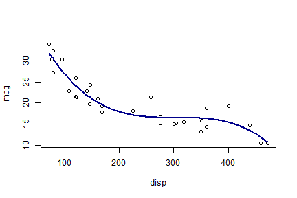

## The Problem of every Data Scientist.

Fitting the right model to your data can some times be really frustrating. 

There are so many options! Fitting every single model on the data 
can take for ever and demands exceptional programming skills.


 

It's unfortunate that there is no easy way to plot all possible models before you make any decisions. 


--- .class #id 

## A Revolutionary Idea 

In order to cover that huge gap a big team of AI and Data Scientists 
in WhatAreYouTalkingAbout Laboratories had a revolutionary idea.


They created an easy to use application that can help every analyst to decide much faster which model is best for the data.

--- .class #id 

## How it Works


The application uses the notorious `mtcars` dataset. 

The user can choose one out of three possible predictors (`disp`, `hp` or `wt`). 

Moreover the user can choose the order of the model (1 to 4). 

Then the App fits automatically the model to the data and plots both the data and the model!!!


---

## Example 1/2

Suppose that the user chooses the `disp` predictor to predict the `mpg` variable and also chooses to fit a 3rd degree simple regression model.
Then the app will perform the following steps:

+ fit the model using the `lm` and the `poly` function:

```r
require(datasets)
data(mtcars)
fit <- lm(mpg~poly(disp,3), data = mtcars)
```

+ plot the model.

Plotting the fitted model is not trivial.
To do so we first use the fitted model in order to predict a lot of `mpg` values and then use `lines` to plot them so that the final curve would be smooth.


---
## Example 2/2
Here is some more coding. 


```r
x_values <- seq(min(mtcars$disp),max(mtcars$disp), length = 300)
new_d <- data.frame(disp = x_values)
pred <- predict(fit, newdata = new_d)
plot(mpg~disp, data = mtcars);lines(x_values, pred, col = "darkblue", lwd = 2)
```




> Thanks for your time!


